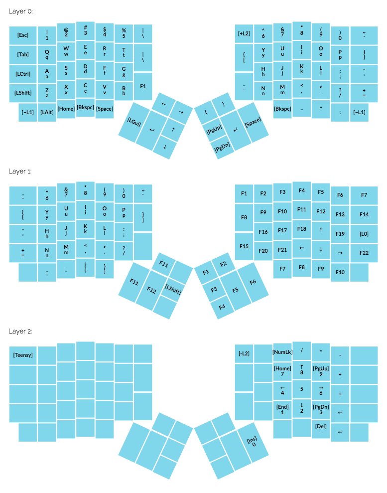

My ergodox ez firmware

## Dependency

### Linux 

sudo apt-get install gcc-avr binutils-avr avr-libc

### Mac OS X

`
brew tap osx-cross/avr
brew install avr-libc
`

##  How to make

make

## How to install

see [Installing firmware](https://github.com/sethherr/ergodox_keymaps#installing-firmware)

## Refs

- [massdrop configuraion tool](https://keyboard-configurator.massdrop.com/ext/ergodox)
- [how to make led working](http://moazzam-khan.com/blog/?p=885)
- [Unofficial memo](https://github.com/inkthink/an-alt-ergodox-ez-layout/wiki/Unofficial-Quick-Reference-to-the-ErgoDox-EZ)